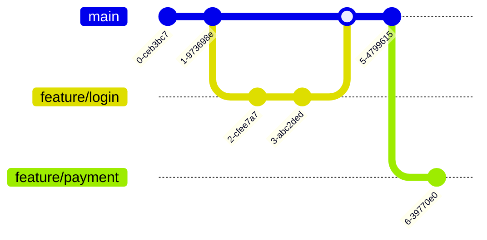

# Comprehensive Software Engineering Guidelines 2025

> [!NOTE]
> This document is the definitive source of truth for engineering standards. It evolves with our stack and industry best practices.

## 1. Core Software Engineering Principles

These universal principles apply across all languages and stacks.

### SOLID Principles
*   **SRP (Single Responsibility)**: A class/module should have one reason to change.
*   **OCP (Open/Closed)**: Open for extension, closed for modification.
*   **LSP (Liskov Substitution)**: Subtypes must be substitutable for their base types.
*   **ISP (Interface Segregation)**: Clients should not depend on unused interfaces.
*   **DIP (Dependency Inversion)**: Depend on abstractions, not concretions.

### DRY (Don't Repeat Yourself)
> [!TIP]
> DRY is about knowledge duplication, not just code duplication. Two lines of code can look identical but represent different business rules.

### KISS (Keep It Simple, Stupid)
Avoid over-engineering.

**❌ Don't:**
```javascript
function getBoolean(value) {
    if (value === true) {
        return true;
    } else {
        return false;
    }
}
```

**✅ Do:**
```javascript
const getBoolean = (value) => !!value;
```

### Code Readability
*   **Naming**: Variables should be nouns (`user`), functions verbs (`getUser`).
*   **Comments**: Explain *why*, not *what*. Code tells you how.
*   **Formatting**: Use Prettier/Black. Consistent spacing is non-negotiable.

### Algorithms & Complexity
*   **Big O Matters**: Know the cost of your code.
    *   **O(1)**: Map lookup (Preferred).
    *   **O(n)**: Loop (Acceptable).
    *   **O(n^2)**: Nested loop (Avoid for large datasets).
*   **Data Structures**:
    *   Use **Maps/Sets** for O(1) lookups.
    *   Use **Arrays** for ordered lists.
    *   Avoid Linked Lists unless implementing specific low-level structures.

## 2. Engineering Culture & Process

### Git Flow & CI/CD
We follow a trunk-based development workflow with short-lived feature branches.



*   **Code Review (LGTM)**:
    *   **Small Changes**: PRs < 400 lines are reviewed 40% faster.
    *   **Tone**: "Have you considered..." instead of "You should...".
*   **DevSecOps**:
    *   > [!WARNING]
    *   > Never commit secrets. Use tools like `trufflehog` in pre-commit hooks.

## 3. Testing Strategy & Principles

### The Test Pyramid
We prioritize fast, reliable unit tests over slow, flaky E2E tests.


### FIRST Principles
*   **F**ast
*   **I**ndependent
*   **R**epeatable
*   **S**elf-validating
*   **T**imely

### Mocking Best Practices
**❌ Don't:** Mock internal private methods.
**✅ Do:** Mock external boundaries (Network, DB, File System).

### Mandatory Requirements
*   **Unit Tests**: All core logic must have unit tests. Target >80% code coverage.
*   **CI/CD**: Every repository must have a GitHub Actions workflow (or equivalent) to run tests on every push.
    *   **Blocker**: PRs must not be mergeable if tests fail.

## 4. Architecture & Design Patterns

### Microservices vs Monolith

| Feature | Monolith | Microservices |
| :--- | :--- | :--- |
| **Deployment** | Single unit | Independent services |
| **Complexity** | Low initially, high later | High operational complexity |
| **Scalability** | Vertical scaling | Horizontal scaling per service |
| **Best For** | Startups, simple domains | Large teams, complex domains |

### Resilience Patterns
*   **Circuit Breaker**: Prevents cascading failures.
*   **Retry with Jitter**: Avoids thundering herds.


### Observability & Scalability
*   **Scalability**:
    *   **Statelessness**: Store state in Redis/DB, not in memory. Allows horizontal scaling.
    *   **Caching**: Use CDN for static assets, Redis for hot data.
*   **Observability**:
    *   **Logs**: Structured JSON logs.
    *   **Metrics**: Prometheus counters/gauges.
    *   **Tracing**: OpenTelemetry for distributed tracing.
    *   **Methodologies**:
        *   **RED** (Services): Rate, Errors, Duration.
        *   **USE** (Infrastructure): Utilization, Saturation, Errors.

## 5. API Design Guidelines

### REST vs GraphQL

| Feature | REST | GraphQL |
| :--- | :--- | :--- |
| **Data Fetching** | Fixed endpoints | Client requests specific fields |
| **Over-fetching** | Common | Solved |
| **Caching** | Easy (HTTP caching) | Harder (Application level) |
| **Versioning** | v1, v2 endpoints | Schema evolution |

### Best Practices
*   **REST**: Use standard HTTP verbs (`GET`, `POST`, `PUT`, `DELETE`).
*   **GraphQL**: Use DataLoaders to solve the N+1 problem.
*   **gRPC**: Use for high-performance internal communication.

## 6. Database Design Principles

### ACID vs BASE
*   **ACID**: Atomicity, Consistency, Isolation, Durability (SQL).
*   **BASE**: Basically Available, Soft state, Eventual consistency (NoSQL).

> [!IMPORTANT]
> Choose **Consistency** (CP) for financial data. Choose **Availability** (AP) for social feeds.

### Performance
*   **Indexing**: Index columns used in `WHERE`, `JOIN`, and `ORDER BY`.
*   **N+1 Problem**: Use `JOIN`s in SQL or batching in ORMs.
*   **Migrations**: Always use version-controlled migrations (Flyway, Liquibase, Prisma). Never change schema manually.

## 7. Security Principles

*   **Zero Trust**: Verify every request, regardless of origin.
*   **OWASP Top 10**: Regularly audit for Injection, Broken Auth, and XSS.
*   **Least Privilege**: Grant minimum necessary permissions.
*   **Data Privacy**: Respect GDPR/CCPA. Encrypt PII at rest and in transit.
*   **Supply Chain Security**:
    *   **Lockfiles**: Always commit `package-lock.json` / `yarn.lock`.
    *   **SBOM**: Generate a Software Bill of Materials for every build.
    *   **Updates**: Use automated tools (Renovate, Dependabot) to patch vulnerabilities.
*   **Security Headers**:
    *   Use `HSTS` to enforce HTTPS.
    *   Use `X-Frame-Options: DENY` to prevent clickjacking.
    *   Use `Content-Security-Policy` (CSP) to mitigate XSS.

## 8. Language-Specific Best Practices

### JavaScript / TypeScript
*   **Strict Mode**: Always use strict mode (default in modules).
*   **Async/Await**: Always use `try/catch` or `.catch()` for error handling.
*   **Validation**: Use Zod or similar libraries for runtime validation.

**❌ Don't:**
```typescript
const user: any = JSON.parse(data);
console.log(user.name); // Runtime error risk
```

**✅ Do:**
```typescript
import { z } from 'zod';

const UserSchema = z.object({
  name: z.string(),
});

const user = UserSchema.parse(JSON.parse(data)); // Safe and typed
```

### React
*   **Hooks**:
    *   Use custom hooks to extract logic from components.
    *   Follow the "Rules of Hooks" (top level only).
*   **Performance**:
    *   Use `useMemo` for expensive calculations.
    *   Use `useCallback` for functions passed to memoized children.
*   **Accessibility**:
    *   Use semantic HTML (`<button>`, not `<div onClick>`).
    *   Ensure all images have `alt` text.
    *   Use `aria-label` where visual context is missing.

**❌ Don't:**
```jsx
// Prop drilling 4 levels deep
<GrandParent user={user} />
```

**✅ Do:**
```jsx
// Use Context or Composition
const UserContext = createContext();
// OR
<GrandParent><Child><UserProfile /></Child></GrandParent>
```

### Python
**✅ Do:** Use Type Hinting and Data Classes.
```python
from dataclasses import dataclass

@dataclass
class User:
    id: int
    name: str

def get_user(user_id: int) -> User:
    ...
```

## 9. Modern Topics (2025)

### AI Coding Ethics
*   **Responsibility**: You are responsible for the code you commit, even if AI wrote it.
*   **Review**: Treat AI suggestions like code from a junior developer—review carefully.
*   **Privacy**: Do not paste proprietary code into public AI models.

### Green Software
*   **Efficiency**: Optimized code consumes less energy.
*   **Carbon Awareness**: Run batch jobs when grid carbon intensity is low.
*   **Right-sizing**: Don't provision a 64-core server for a simple cron job.

### LLM Engineering
*   **Prompt Engineering as Code**: Version control your prompts. Treat them like functions.
*   **RAG (Retrieval-Augmented Generation)**: Use vector databases (Pinecone, Milvus) to ground LLMs in your data.
*   **Evals**: Don't guess. Use automated evaluation frameworks (DeepEval, Ragas) to measure LLM performance.

## 10. Architecture Decision Records (ADRs)

> [!TIP]
> Don't rely on memory. Document *why* you chose a specific technology or pattern.

We use **ADRs** to capture significant architectural decisions.
*   **Format**: Title, Status (Proposed/Accepted/Deprecated), Context, Decision, Consequences.
*   **Location**: `/docs/adr/001-use-postgres.md`
*   **When to write**: Any decision that affects the system's structure or non-functional characteristics.

## 11. Incident Management & Post-Mortems

Failure is an opportunity to learn, not to blame.

### The "5 Whys" Technique
When an incident occurs, ask "Why?" five times to find the root cause.
1.  **Why** did the server crash? (Memory leak)
2.  **Why** was there a memory leak? (Unclosed DB connections)
3.  **Why** were connections unclosed? (Exception handler didn't close them)
4.  **Why** didn't the handler close them? (Bug in `finally` block)
5.  **Why** wasn't this caught? (No unit test for exception path) -> **Root Cause**

### Blameless Post-Mortems
*   **Focus**: Process and technology, not people.
*   **Output**: Actionable items to prevent recurrence (e.g., "Add linter rule", "Update runbook").

## 12. Internationalization (i18n)

Build global-ready software from Day 1.

*   **No Hardcoded Strings**: Use keys (e.g., `welcome_message`).
*   **Formatting**: Use `Intl` API for dates, numbers, and currencies.
*   **RTL Support**: Ensure layouts work for Right-to-Left languages (Arabic, Hebrew).

**❌ Don't:**
```javascript
const price = "$" + amount; // Assumes USD and position
```

**✅ Do:**
```javascript
const price = new Intl.NumberFormat('en-US', { style: 'currency', currency: 'USD' }).format(amount);
```

## 13. Standard Configuration

Copy-paste this `.editorconfig` to the root of your project for instant consistency across IDEs.

```ini
# .editorconfig
root = true

[*]
indent_style = space
indent_size = 4
end_of_line = lf
charset = utf-8
trim_trailing_whitespace = true
insert_final_newline = true

[*.{js,jsx,ts,tsx,json,yml,yaml}]
indent_size = 2

[*.md]
trim_trailing_whitespace = false
```

## 14. Docs as Code

Treat documentation with the same rigor as software.

*   **Version Control**: Docs live in the repo with the code.
*   **Review**: Docs changes require PRs and review.
*   **Testing**: Check for broken links and spelling in CI.
*   **Tools**: Markdown, Mermaid, Docusaurus/MkDocs.
*   **Reference**: [Creating diagrams on GitHub](https://docs.github.com/en/get-started/writing-on-github/working-with-advanced-formatting/creating-diagrams)

## 15. Cloud Native Development

Build for the cloud, not just in the cloud.

*   **Infrastructure as Code (IaC)**:
    *   **Declarative**: Use Terraform, OpenTofu, or Pulumi. Avoid manual console clicks.
    *   **Policy as Code**: Use OPA (Open Policy Agent) to enforce security rules (e.g., "No public S3 buckets").
*   **Containers**:
    *   **Small Images**: Use Alpine or Distroless base images.
    *   **Multi-Stage Builds**: Separate build environment from runtime to reduce size.
*   **Serverless**:
    *   **Event-Driven**: Trigger functions via events (S3 upload, Queue message) rather than polling.
    *   **Cold Starts**: Keep functions small. Use provisioned concurrency for latency-sensitive paths.
*   **FinOps**:
    *   **Tagging**: Tag every resource with `CostCenter`, `Environment`, and `Owner`.
    *   **Lifecycle**: Auto-archive old logs/data to cheaper storage (S3 Glacier).

## 16. Mobile Development (General)

Principles for iOS and Android.

*   **Offline-First**:
    *   **Local DB**: Use Realm, SQLite, or WatermelonDB. The app should work without internet.
    *   **Optimistic UI**: Update the UI immediately on user action, sync in background. Rollback on error.
*   **Battery Efficiency**:
    *   **Batching**: Group network requests to keep the radio off longer.
    *   **Background Tasks**: Respect OS limits. Don't poll; use push notifications.
*   **Permissions**:
    *   **Contextual**: Ask for Camera permission *when* the user taps the camera button, not at launch.
    *   **Just-in-Time**: Explain *why* you need it before the OS dialog appears.

## 17. iOS Development (Swift & SwiftUI)

*   **SwiftUI First**: Use SwiftUI for all new features. Drop down to UIKit only for complex custom interactions.
*   **Concurrency**:
    *   **Async/Await**: Preferred for readability and safety.
    *   **Actors**: Use for shared mutable state to prevent data races.
*   **Architecture**:
    *   **MVVM**: Standard for SwiftUI.
    *   **TCA (The Composable Architecture)**: For complex state management and testability.
*   **Best Practices**:
    *   **Structs > Classes**: Prefer value types.
    *   **No Force Unwrap**: Avoid `!` like the plague. Use `if let` or `guard let`.

## 18. Android Development (Kotlin)

*   **Kotlin First**: Java is legacy. Use Kotlin for all new code.
*   **Jetpack Compose**: Use declarative UI (Compose) over XML layouts.
*   **Coroutines**: Use Coroutines and Flow for asynchronous programming (lighter than threads).
*   **Architecture**:
    *   **MVVM/MVI**: Recommended patterns with `ViewModel` and `StateFlow`.
    *   **Dependency Injection**: Use Hilt or Koin.

## 19. Production Readiness Checklist

*   [ ] **Observability**: Logs (JSON), Metrics (Prometheus), Tracing (OpenTelemetry).
*   [ ] **Security**: HTTPS, CSP Headers, Dependency Scan.
*   [ ] **Reliability**: Backups tested, Auto-scaling configured.
*   [ ] **Accessibility**: WCAG 2.1 AA Compliant.

## 20. Evolving These Guidelines

This document is not static. It is a **Living Document**.

*   **RFC Process**: To change a guideline, open a "Request for Comments" (RFC) issue.
*   **Regular Review**: Engineering leads review this doc quarterly to remove outdated rules and add new learnings.
*   **Exception Policy**: If a guideline blocks progress, document the exception in an ADR and proceed.

> "The best processes are the ones that serve the team, not the other way around."
